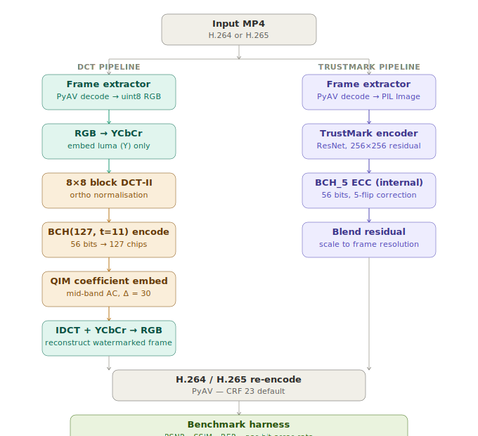

# video_watermark

A research benchmark comparing two video watermarking approaches side by side:

- **DCT** — classical frequency-domain embedding using QIM and BCH error correction
- **TrustMark** — Adobe's ML-based method ([adobe/trustmark](https://github.com/adobe/trustmark))

Both embed a **56-bit (7-byte) payload** per frame and are evaluated after a full H.264/H.265 codec round-trip using PSNR, SSIM, and bit error rate.

---

## Architecture



Both pipelines share the same PyAV-based frame extractor and re-encoder. The DCT pipeline embeds watermarks by modifying mid-band DCT coefficients in the luma channel; TrustMark adds a learned residual at 256×256 and scales it to the frame. Metrics are measured from the re-encoded output so both methods face the same codec stress.

### ECC comparison

| Method | ECC scheme | Codeword | Payload | Max bit-flips corrected |
|---|---|---|---|---|
| DCT | BCH(n=127, t=11, m=7) | 127 chips | 56 bits | **11 / 127 = 8.7 %** |
| TrustMark | BCH_5 (internal) | 100 bits | 56 bits | **5 / 100 = 5.0 %** |

---

## Installation

**Requires Python ≥ 3.9.**

```bash
# 1. Core dependencies (DCT method + benchmark harness)
pip install -r requirements.txt

# 2. ML method — TrustMark (optional, ~200 MB model download on first run)
pip install -r requirements-ml.txt

# 3. Install this package in editable mode
pip install -e .
```

For GPU-accelerated TrustMark inference, install PyTorch with CUDA
**before** step 2 (adjust the CUDA version tag to match your driver):

```bash
pip install torch torchvision --index-url https://download.pytorch.org/whl/cu128
pip install -r requirements-ml.txt
pip install -e .
```

See [`requirements.txt`](requirements.txt) and [`requirements-ml.txt`](requirements-ml.txt) for pinned version details and conda/CUDA instructions.

---

## Quick start

```bash
# Run both methods on the first 60 frames of a clip
python -m video_watermark.benchmark.run \
    --input  clip.mp4 \
    --outdir results/

# Generate comparison plots from the saved results
python -m video_watermark.benchmark.report results/benchmark_results.json
```

The benchmark prints a side-by-side table on completion and writes:

```
results/
├── benchmark_results.json      # full numeric results
├── dct_watermarked.mp4         # watermarked output (DCT)
├── trustmark_watermarked.mp4   # watermarked output (TrustMark)
├── comparison_quality.png      # PSNR + SSIM per frame
├── comparison_ber.png          # BER per frame
├── comparison_per_bit.png      # per-bit error rate heatmap (7×8)
└── comparison_summary.png      # headline bar chart
```

---

## Command-line reference

### `benchmark.run` — encode, decode, and measure

```
python -m video_watermark.benchmark.run [options]
```

#### Required

| Option | Description |
|---|---|
| `--input PATH` | Input MP4 file (H.264 or H.265) |

#### Payload

| Option | Default | Description |
|---|---|---|
| `--payload-int HEX` | `0xDEADBEEFCAFEBA` | 56-bit payload as a hex literal. Use `0x` prefix. Must fit in 7 bytes (≤ `0xFFFFFFFFFFFFFF`). |

#### Frame selection

| Option | Default | Description |
|---|---|---|
| `--max-frames N` | `60` | Stop after N frames. Set to a large number or omit for a full video run. |
| `--eval-every-nth N` | `1` | Measure metrics on every N-th frame. Use `2` or `4` to speed up long clips while keeping a representative sample. |

#### Codec settings

| Option | Default | Description |
|---|---|---|
| `--outdir PATH` | `results/` | Directory for watermarked MP4s and `benchmark_results.json`. Created if absent. |
| `--codec` | `libx264` | Re-encode codec. Choices: `libx264`, `libx265`. Use `libx265` to stress-test robustness under stronger compression. |
| `--crf N` | `23` | Constant Rate Factor for the re-encode. Lower = better quality / less compression. Range 0–51; 18 is near-lossless, 28 is moderate compression. |

#### DCT watermarker

| Option | Default | Description |
|---|---|---|
| `--dct-delta FLOAT` | `30.0` | QIM quantisation step. Larger values are more robust but slightly more visible. `30.0` is calibrated to survive H.264 CRF ≤ 28. Reduce to `15–20` for higher PSNR at the cost of some robustness. |
| `--dct-num-blocks N` | `1` | DCT blocks polled per chip during decode for an inner majority vote on top of BCH. `1` is sufficient at `delta=30`; raise to `2–3` if using a lower delta. |
| `--dct-key STRING` | `video_watermark_key` | Secret key seeding the pseudo-random block selection sequence. Must be identical between encoder and decoder. |

#### TrustMark watermarker

| Option | Default | Description |
|---|---|---|
| `--trustmark-model` | `Q` | Model variant. Choices: `Q` (best all-round), `P` (highest visual quality, similar robustness), `B`, `C` (smaller/faster). |
| `--trustmark-strength FLOAT` | `1.0` | Watermark strength multiplier passed to `TrustMark.encode()`. Raise to `1.5` for print/severe-distortion robustness; lower to `0.8` for minimal visibility. |

#### Selective runs

| Option | Description |
|---|---|
| `--no-dct` | Skip the DCT method (run TrustMark only). |
| `--no-trustmark` | Skip TrustMark (run DCT only, no `trustmark` install required). |

#### Examples

```bash
# DCT only, high-CRF stress test (strong H.265 compression)
python -m video_watermark.benchmark.run \
    --input clip.mp4 \
    --no-trustmark \
    --codec libx265 \
    --crf 32 \
    --dct-delta 40

# TrustMark only, maximum-quality model, all frames
python -m video_watermark.benchmark.run \
    --input clip.mp4 \
    --no-dct \
    --trustmark-model P \
    --max-frames 9999

# Custom 7-byte payload, evaluate every 3rd frame
python -m video_watermark.benchmark.run \
    --input clip.mp4 \
    --payload-int 0xCAFEBABEDEAD42 \
    --eval-every-nth 3

# Both methods, near-lossless re-encode (isolate watermark distortion from codec)
python -m video_watermark.benchmark.run \
    --input clip.mp4 \
    --crf 12
```

---

### `benchmark.report` — generate plots

```
python -m video_watermark.benchmark.report results/benchmark_results.json
```

Reads the JSON written by `benchmark.run` and saves four PNG plots next to it. No extra options.

---

## Python API

### DCT watermarker

```python
from video_watermark.dct.watermarker import DCTWatermarker
import numpy as np

wm = DCTWatermarker(
    secret_key="my_key",   # str or bytes
    delta=30.0,            # QIM step
    num_blocks=1,          # blocks polled per chip
)

# 7-byte payload -> 56-bit array
payload = wm.bytes_to_bits(b"\xDE\xAD\xBE\xEF\xCA\xFE\xBA")

# Encode a single uint8 RGB frame (H, W, 3)
watermarked = wm.encode(frame, payload)

# Decode -- returns (56,) uint8, BCH-corrected
recovered = wm.decode(watermarked)

# Decode with diagnostics (how many chip errors did BCH fix?)
stats = wm.decode_with_stats(watermarked)
# stats["payload_bits"]       -> (56,) uint8
# stats["raw_chips"]          -> (127,) uint8 before BCH
# stats["n_errors_corrected"] -> int, -1 if uncorrectable
```

### TrustMark video adapter

```python
from video_watermark.trustmark_video.adapter import TrustMarkVideoWatermarker

wm = TrustMarkVideoWatermarker(
    model_type="Q",    # 'Q', 'P', 'B', or 'C'
    strength=1.0,
)

watermarked = wm.encode_frame(frame, payload)
bits, detected = wm.decode_frame(watermarked)
# detected: bool -- TrustMark's own confidence flag
```

### Full video pipeline

```python
from video_watermark.utils.video_io import (
    apply_watermark_to_video,
    decode_watermark_from_video,
    every_nth,
)
from video_watermark.dct.watermarker import DCTWatermarker

wm      = DCTWatermarker()
payload = wm.bytes_to_bits(b"ACME\x00\x01\x02")

# Watermark every other frame (faster for long clips)
apply_watermark_to_video(
    "input.mp4", "output.mp4",
    watermarker=wm,
    payload_bits=payload,
    frame_selector=every_nth(2),
    codec="libx264",
    crf=23,
)

result = decode_watermark_from_video(
    "output.mp4",
    watermarker=wm,
    frame_selector=every_nth(2),
)
# result["payload_bits"]  -> (56,) uint8  -- majority-voted across frames
# result["confidence"]    -> (56,) float  -- per-bit vote fraction
# result["frame_bits"]    -> list of (frame_idx, bits) tuples
# result["n_decoded"]     -> int
```

### Benchmark runner (programmatic)

```python
from video_watermark.benchmark.run import BenchmarkRunner, BenchmarkConfig

cfg = BenchmarkConfig(
    payload_int=0xDEADBEEFCAFEBA,
    max_frames=120,
    crf=23,
    codec="libx264",
    dct_delta=30.0,
    trustmark_model="Q",
    trustmark_strength=1.0,
    run_dct=True,
    run_trustmark=True,
)
runner  = BenchmarkRunner(cfg)
results = runner.run("clip.mp4", "results/")
runner.print_comparison(results)
runner.save_results(results, "results/")
```

---

## Metrics

| Metric | Target | Notes |
|---|---|---|
| PSNR >= 42 dB | Invisible watermark | < 38 dB is often perceptible |
| SSIM >= 0.98 | High perceptual fidelity | Measured per frame, channel-averaged |
| BER = 0.0 | Perfect recovery | 0.5 = random (no watermark detected) |
| Exact match rate | 1.0 | Fraction of frames with all 56 bits correct |
| Norm correlation | 1.0 | +/-1 coding; 0 = random, 1 = perfect |
| `n_errors_corrected` (DCT) | <= 11 | BCH chip errors corrected per frame |

---

## Project layout

```
video_watermark/
├── dct/
│   └── watermarker.py          DCT-QIM encoder + BCH(127,t=11) ECC
├── trustmark_video/
│   └── adapter.py              TrustMark per-frame adapter (BCH_5, 56 bits)
├── utils/
│   └── video_io.py             PyAV decode / re-encode helpers
├── benchmark/
│   ├── metrics.py              PSNR, SSIM, BER, per-bit error rate
│   ├── run.py                  CLI + BenchmarkRunner API
│   └── report.py               Matplotlib plot generator
├── docs/
│   └── architecture.svg        Pipeline diagram (embedded above)
├── requirements.txt            Core dependencies
├── requirements-ml.txt         Optional TrustMark / GPU dependencies
├── CLAUDE.md                   Developer handoff notes for Claude Code
└── setup.py
```

---

## Design notes

### Why luma-only for DCT?

H.264 and H.265 apply aggressive chroma subsampling (4:2:0) and quantise chroma channels more heavily than luma. Any modification to Cb/Cr is largely destroyed during re-encode. Embedding in the Y channel preserves the watermark across codec round-trips.

### Why mid-band DCT coefficients?

Low-frequency coefficients (DC, first few AC) carry most of the visible energy — modifying them creates visible artefacts. High-frequency coefficients are zeroed out by the codec's quantisation matrix at moderate CRF values. Mid-band (zigzag indices 5–14) is the surviving sweet spot: coefficients are small enough to modify invisibly but large enough to survive quantisation at `delta = 30`.

### Why BCH(127, t=11) for DCT?

The 127-bit codeword fits naturally in the embedding budget (one chip per block, ~127 blocks per frame at 480p). t = 11 corrects up to 8.7 % chip BER — empirically sufficient for H.264 CRF 23, where we observe 0–10 chip errors per frame in testing. This intentionally mirrors TrustMark's internal BCH_5 philosophy: sacrifice payload throughput for maximum error resilience.

### Fair comparison notes

- Both methods are measured after a full codec round-trip, not from raw watermarked frames.
- TrustMark carries 56 of its 61 available BCH_5 bits; the remaining 5 are spare.
- DCT `delta` is tunable: lower values improve PSNR but reduce post-codec robustness. `30.0` is the empirical knee point for H.264 CRF 23.
- TrustMark `strength` works similarly — `1.0` is the default; `1.5` trades visibility for robustness.

---

## Dependencies

See [`requirements.txt`](requirements.txt) for core packages and pinned versions,
and [`requirements-ml.txt`](requirements-ml.txt) for the optional TrustMark ML
dependencies and GPU setup instructions.

| Package | Role |
|---|---|
| `av` | FFmpeg bindings — frame decode / re-encode |
| `numpy`, `scipy` | DCT, array ops |
| `bchlib==2.1.3` | BCH(127, t=11) ECC for the DCT pipeline |
| `scikit-image` | PSNR, SSIM |
| `Pillow` | PIL Image interface for TrustMark |
| `tqdm` | Progress bars |
| `matplotlib` | Plot generation |
| `trustmark` | Adobe TrustMark ML model *(optional)* |

---

## License

MIT.  TrustMark is also MIT-licensed: [adobe/trustmark](https://github.com/adobe/trustmark).
